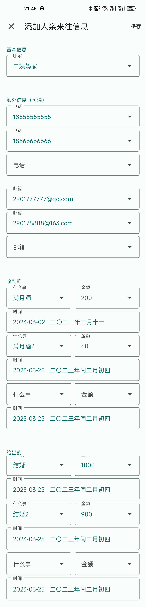
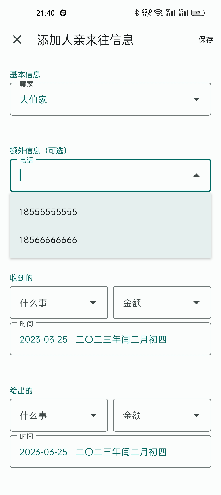
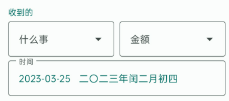
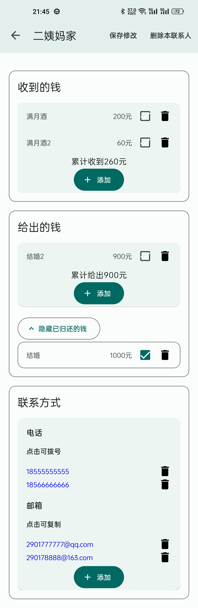

# 人亲记录器
人亲是四川方言，翻译过来就是亲戚家办喜事时，随的份子钱。

因为看到家人在随份子钱之前都会翻阅几大本册子，来判断这次要随多少；册子里面都是记录的上次自己家办事情的时候所有来随份子钱的人的信息和金额，翻册子很繁琐，所以我制作了此款app，能够记录人亲信息，方便随时查阅。

- 极简UI，避免页面元素对中老年人的干扰
- 对输入内容的醒目的提示信息
- 以文本按钮替代图标按钮，更易懂

​                                    **“下载apk体验”文件夹内有安装包**

**技术栈：**Kotlin + MVVM + Room数据库 + DataStore + Flow + LiveData + 协程

**设计语言：**Material Design 3 + Dynamic Color

### 使用指南：

1. 右下角点击添加联系人

2. 长按联系人列表可进行删除

3. 电话、邮箱、事件信息数目填写无上限，当填好一个之后自动会增加一个空白的输入框

3. 所有手动新增的电话、邮箱、事件、数目都会加入DownList，方便下次填写

5. 选择日期后会自动增加农历，方便部分人群

6. 事件可进行勾选和删除，如果进行了勾选，会加入已归还列表，点击展开列表即可查看，同样，可以逆向操作

7. 电话直接点击会跳转到拨号页面

8. 邮箱直接点击会进行赋值

